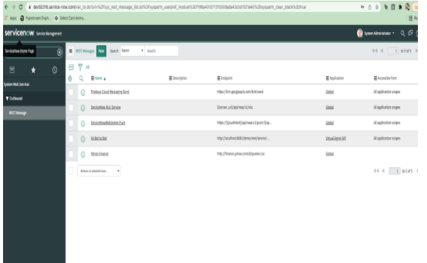

# Configure ServiceNow instance

To setup CCC with ServiceNow you need to follow this steps
- Go to https://developer.servicenow.com/dev.do#!/home
- Create account
- Create instance (Rome)
- Click on start building button
- Follow all steps in this video https://www.youtube.com/watch?v=jc7FyaFz6Cw
- Make sure you are install latest version of Virtual Agent Api v2.1
- Go to REST Message

- Click on PostMessage

- Click on edit and change Endpoint to `https://<env_domain>/service-now/webhook`