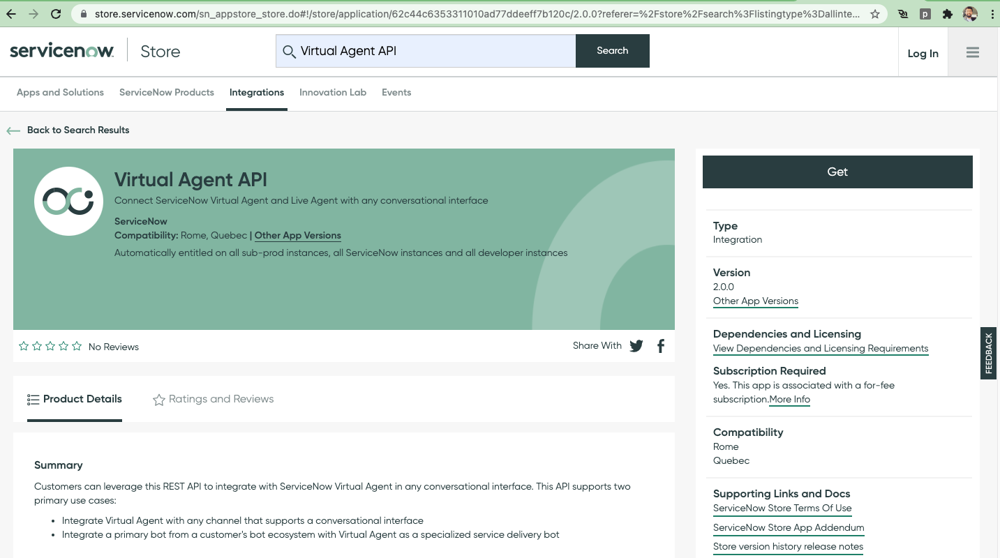
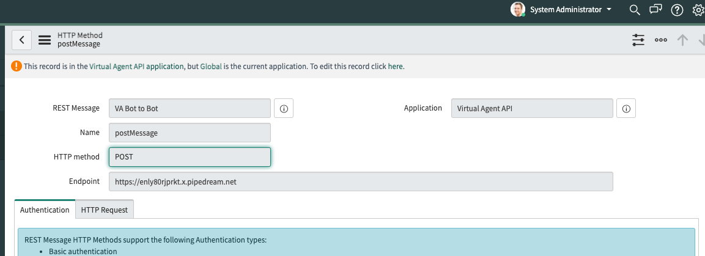
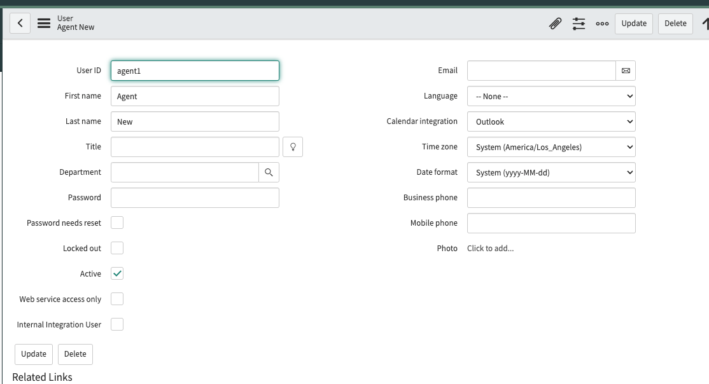
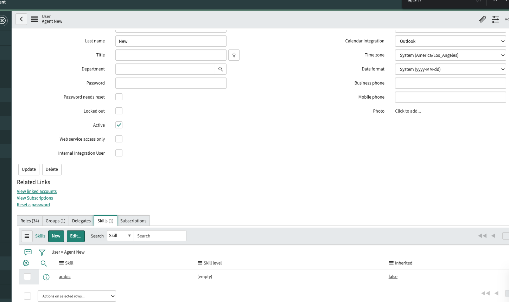

#Config ServiceNow

- Install `virtual agent api v2` plugin from servicenow store
  

- Change `VA Bot to Bot` Rest Message => PostMessage endpoint to match contact center pro url  
  

- Create new agent
  

- Assign skill to agent
  