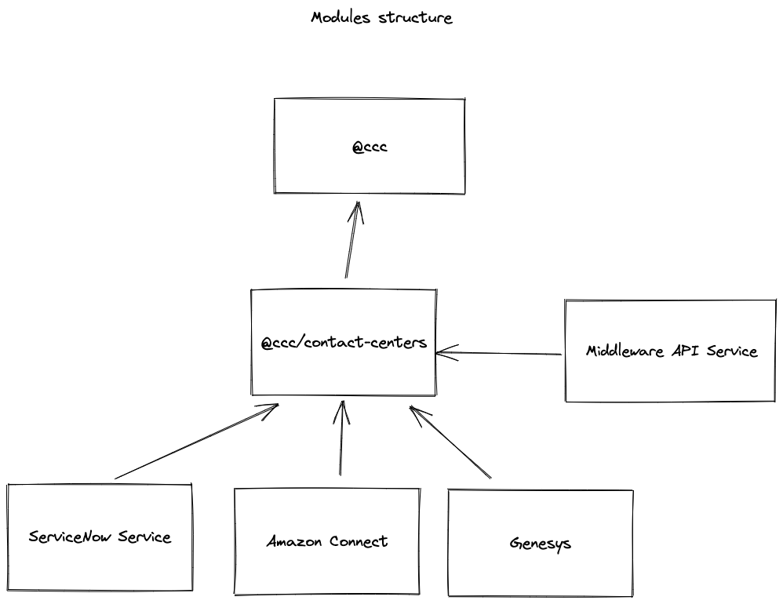

# Modules structure

Let's take a look at CCC modules structure
  

The basics of this is pretty simple:

- SDK module which wrap `agent services` and `end-user services` and export it as re-usable sdk
- @ccc/nestjs-client which when imported into your nestjs project provides a SDK client to any class that injects it. This lets SDK be worked into your dependency injection workflow without having to do any extra work outside of the initial setup.
- @ccc/Nestjs-app
  - Will receive webhooks and trigger the appropriate SDK actions   
  - import @ccc/nestjs-client and pass down sdk configurations 